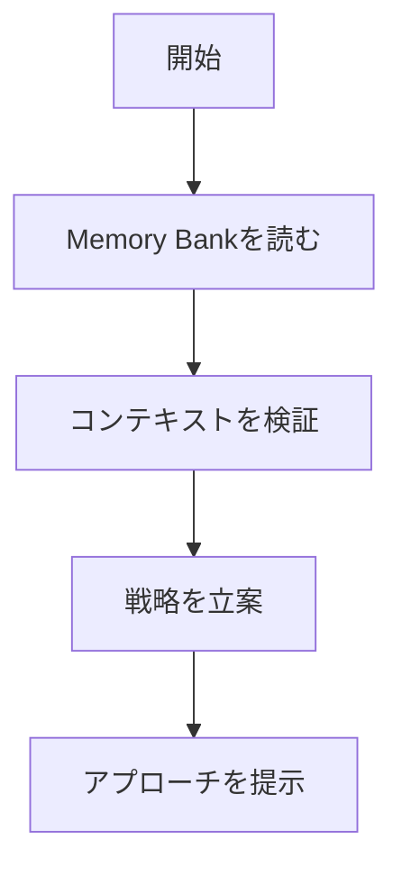
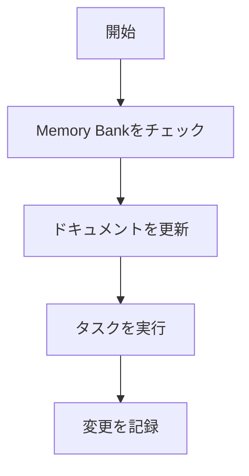

# AIアシスタント ワークフロー

このドキュメントは、AIアシスタント（Cline）との協業におけるワークフローとガイドラインを定義します。

## 基本原則

-   AIアシスタントはセッションごとに記憶がリセットされます。
-   **メモリバンク（Memory Bank）** が唯一の永続的な情報源です。
-   すべてのタスクを開始する前に、AIアシスタントは必ずメモリバンク内のファイルを読み込みます。

## コアワークフロー

AIアシスタントのワークフローは、主に3つのモードで構成されます。

### 1. Plan Mode（計画モード）

タスクの開始時に、メモリバンクの情報を基に状況を把握し、具体的な実行計画を立案します。



### 2. Act Mode（実行モード）

計画に基づき、コードの修正、テストの実行、ドキュメントの更新など、具体的なタスクを実行します。



### 3. Debug Mode（デバッグモード）

問題発生時に、KT法（ケプナー・トリゴー法）を参考に、体系的な問題解決プロセスを実行します。

```mermaid
flowchart TD
    subgraph "Phase 1: 調査 & 仮説立案"
        A[問題発生] --> B[自律調査 (Memory Bank, Git, Code)];
        B --> C[調査結果に基づき複数の仮説を立案];
    end

    subgraph "Phase 2: チェックリスト化と記録"
        C --> D[仮説をMarkdownチェックリスト形式で整形];
    end

    subgraph "Phase 3: 体系的な仮説検証"
        D --> F{チェックリストの先頭から検証開始};
        F --> H[ツール(grep等)を使い検証実行];
        H --> I{仮説は正しかったか？};
        I -- Yes --> J[原因特定];
        I -- No --> K[チェックリストを更新];
        K --> L{他に未検証の仮説は？};
        L -- Yes --> F;
        L -- No --> M[情報不足。ユーザーに追加質問];
    end

    subgraph "Phase 4: 完了と記録"
        J --> N[対策案を立案し提示];
    end
```

## ドキュメント更新

-   実装内容は、まず `activeContext.md` に「今フォーカス中のタスク」として記載します。
-   実装が完了した機能は `progress.md` に移動します。
-   メモリバンクの更新は、`update memory bank` コマンドで行い、変更は必ずGitにコミット＆プッシュします。

詳細なルールやガイドラインについては、`.clinerules` ファイルを参照してください。
